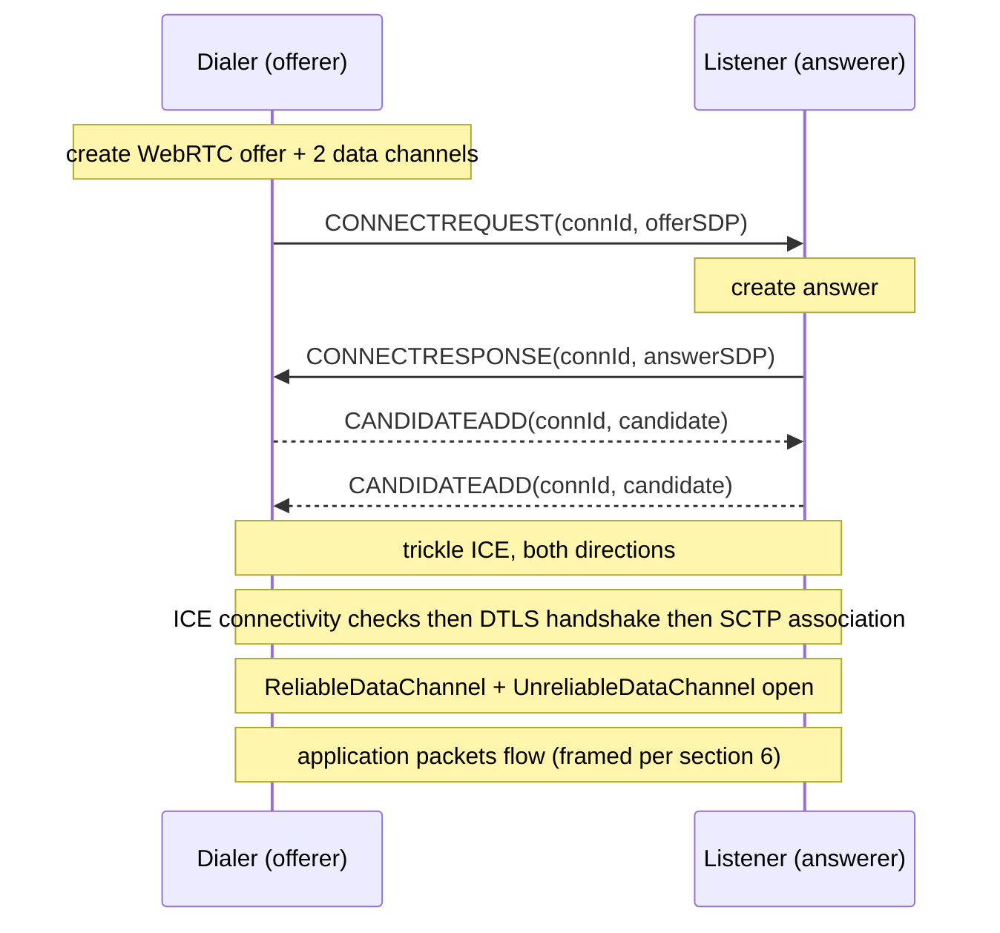
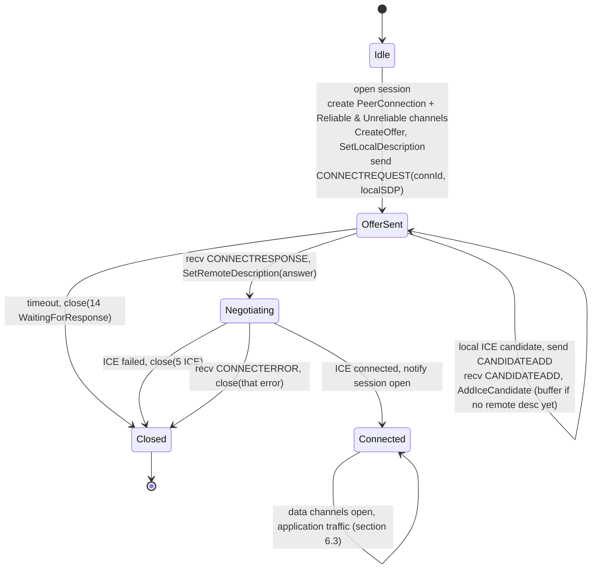
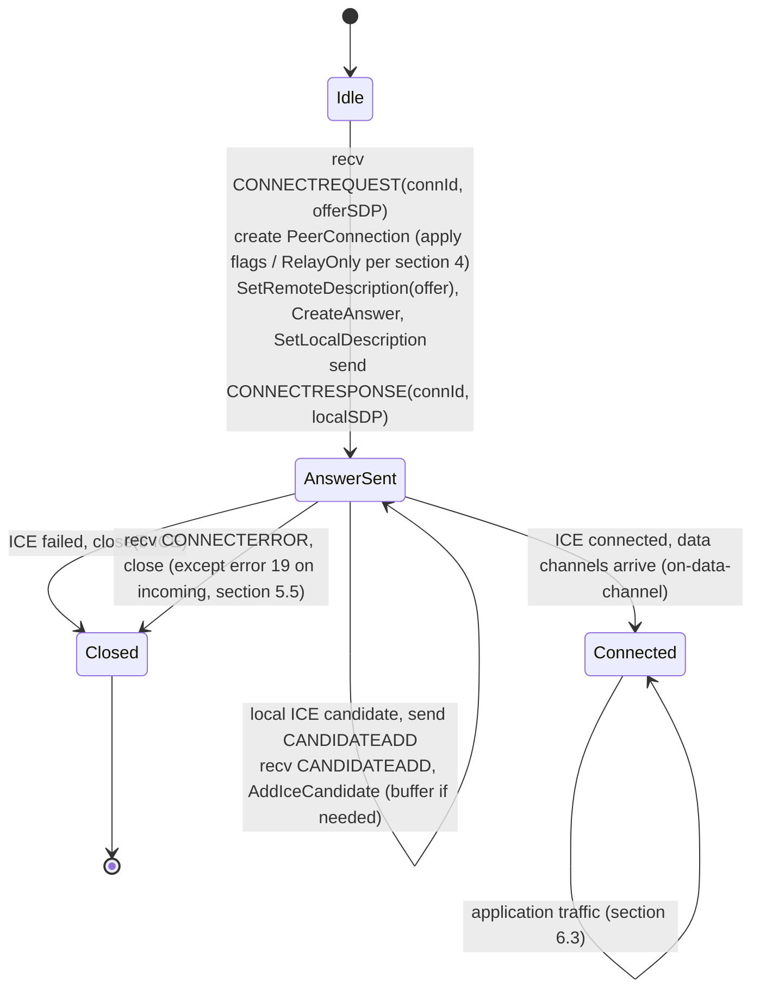

# NetherNet Protocol Specification

**Status:** Draft / implementer-ready · **Scope:** wire protocol, observable behavior only
**Covers:** LAN discovery + LAN signaling + the abstract signaling-channel interface +
WebRTC session negotiation and data-channel framing.

> **What NetherNet is.** NetherNet is a peer-to-peer transport for LAN and online
> multiplayer, layered on top of **WebRTC** (ICE + DTLS + SCTP data channels): a lightweight
> **signaling** plane carries SDP offers/answers and ICE candidates between two peers, after
> which an ordinary WebRTC peer connection carries application traffic over two SCTP data
> channels. On LAN, an encrypted UDP **discovery** plane both advertises hosts and tunnels
> the signaling messages, so no server is required.

---

## 1. Conventions

- The key words **MUST**, **MUST NOT**, **SHOULD**, **SHOULD NOT**, and **MAY** are to be
  interpreted as in RFC 2119.
- **All integers on the wire are little-endian**, unless a field is defined as an ASCII
  text token (signaling) or is an opaque, application-defined payload.
- "Peer" identities are `NetworkID`s (§3). A "session" (a single connection attempt
  between two peers) is identified by a 64-bit `ConnectionId` (a.k.a. `RAWNETWORKID`, §3.3).
- Byte-offset tables list fields top-to-bottom in ascending memory/wire order. `u16`/`u32`/
  `u64` denote little-endian unsigned integers of that width.
- An implementation is **conformant** if it produces and accepts the byte sequences and
  message orderings defined here. Configurable parameters state their default values inline;
  non-normative notes are collected in §12.

---

## 2. Architecture overview

Two peers establish a connection through three cooperating planes:



- **Signaling plane (§5):** short ASCII text messages (`CONNECTREQUEST`, `CONNECTRESPONSE`,
  `CANDIDATEADD`, `CONNECTERROR`) exchanged through a pluggable **signaling channel** (§5.1).
  The LAN discovery-message transport (§7.4) is one such channel.
- **Transport plane (§6):** a standard WebRTC `PeerConnection` with two SCTP data channels.
- **LAN discovery plane (§7–§8):** encrypted UDP broadcast for host advertisement and for
  carrying signaling messages between LAN peers.

Roles: the **dialer** is the WebRTC *offerer* (creates the data channels); the **listener**
is the *answerer*. A peer MAY act in either role per session.

---

## 3. Identifiers — `NetworkID`

### 3.1 Forms

A `NetworkID` identifies a peer and is one of:

| Form | Underlying value | String form (`toString`) |
|------|------------------|--------------------------|
| **P2P** | `u64` | decimal digits of the `u64`, e.g. `"1234567890"` |
| **Realms** | 128-bit UUID | canonical UUID string |
| *(unset)* | none | empty / invalid |

A peer used over LAN signaling and discovery is always the **P2P** form (a `u64`). The
Realms form appears in online contexts. An implementation targeting LAN MAY support only the
P2P form.

### 3.2 Parsing a `NetworkID` from a string

Given a string, determine the form in this order:
1. If it parses as an unsigned decimal integer with no surrounding whitespace → **P2P**
   (value = the integer).
2. Else if it is a parseable UUID → **Realms**.
3. Else → unset/invalid.

### 3.3 `ConnectionId` / `RAWNETWORKID`

`RAWNETWORKID` is a `u64`. It is used as the **session/connection id** in signaling
messages (§5). The dialer **MUST** generate a fresh, effectively-random `u64` ConnectionId
for each outgoing session and reuse it for every signaling message of that session; the
listener echoes it back. Implementations **SHOULD** use a cryptographically-unpredictable or
at least well-distributed source (e.g. 8 random bytes).

### 3.4 Correlation id (diagnostic, optional)

For logging, a P2P `NetworkID` MAY be rendered as a correlation id:
`"<nethernet>WWWW-WWWW-WWWW-WWWW"`, where the four `WWWW` groups are the four 16-bit words of
the `u64`, **most-significant word first**, each formatted as 4 lowercase hex digits. This is
diagnostic only and never appears on the wire.

---

## 4. Error codes — `ESessionError`

A single enum is used for session errors throughout (carried in `CONNECTERROR` and surfaced
to the application on session close). Values are stable:

| Value | Name | | Value | Name |
|------:|------|-|------:|------|
| 0 | None | | 18 | SignalingUnknownError |
| 1 | DestinationNotLoggedIn | | 19 | SignalingUnicastMessageDeliveryFailed |
| 2 | NegotiationTimeout | | 20 | SignalingBroadcastDeliveryFailed |
| 3 | WrongTransportVersion | | 21 | SignalingMessageDeliveryFailed |
| 4 | FailedToCreatePeerConnection | | 22 | SignalingTurnAuthFailed |
| 5 | ICE | | 23 | SignalingFallbackToBestEffortDelivery |
| 6 | ConnectRequest | | 24 | NoSignalingChannel |
| 7 | ConnectResponse | | 25 | NotLoggedIn |
| 8 | CandidateAdd | | 26 | SignalingFailedToSend |
| 9 | InactivityTimeout | | 27 | RelayServerConfigurationResultFailure |
| 10 | FailedToCreateOffer | | 28 | RelayServerConfigurationResultParsingErrorNoUrls |
| 11 | FailedToCreateAnswer | | 29 | RelayServerConfigurationResultParsingErrorNoCreds |
| 12 | FailedToSetLocalDescription | | 30 | RelayServerConfigurationResultParsingErrorNoServers |
| 13 | FailedToSetRemoteDescription | | 31 | RelayServerConfigurationResultParsingErrorNoExpiration |
| 14 | NegotiationTimeoutWaitingForResponse | | 32 | DataChannelClosed |
| 15 | NegotiationTimeoutWaitingForAccept | | 33 | InternalErrorJsonSerialization |
| 16 | IncomingConnectionIgnored | | 34 | InvalidArgument |
| 17 | SignalingParsingFailure | | 35 | GenericFailure |

**Send reliability** (`ESendType`): `Unreliable = 0`, `Reliable = 1`.

**Connection flags** (`EConnectionFlags`, bitmask, configure ICE candidate filtering):
`None=0`, `RelayOnly=1`, `NoTCPCandidates=2`, `NoLocalCandidates=4`,
`NoServerReflexiveCandidates=8`, `NoPeerReflexiveCandidates=16`, `NoRelayCandidates=32`.
When `RelayOnly` is set, the peer **MUST** restrict ICE to relay (TURN) candidates only —
equivalently, set the WebRTC `RTCConfiguration.type` to `IceTransportsType::kRelay` (value
`1`).

---

## 5. Signaling protocol

### 5.1 Signaling channel (abstract)

A **signaling channel** delivers signaling messages between peers and MUST provide:
- **send**: deliver a message string from a local `NetworkID` to a remote `NetworkID`.
- **receive**: surface inbound `(senderNetworkID, messageString)` events.

The **LAN binding** (§7.4) carries the exact same message strings inside encrypted discovery
*Message* packets. A peer reachable on LAN and with LAN signaling enabled **SHOULD** prefer
the LAN binding when the remote `NetworkID` is known to be on the LAN.

### 5.2 Message wire format

Every signaling message is an ASCII string of exactly **three space-separated tokens**:

```
<IDENTIFIER> <connectionId> <data>
```

- Token 0 = `IDENTIFIER` (§5.3), an uppercase ASCII keyword.
- Token 1 = `connectionId`, the session `u64` rendered as decimal ASCII.
- Token 2 = `data`, message-specific. **It MAY itself contain spaces and newlines** (SDP
  blobs do). Therefore parsing **MUST** split on the **first two** spaces only and treat the
  remainder as `data`.

A receiver **MUST** reject (ignore) a message whose token 0 is not a recognized identifier,
whose token 1 does not parse as a `u64`, or that has fewer than three tokens.

### 5.3 Messages

| Identifier | Direction | `data` (token 2) |
|------------|-----------|------------------|
| `CONNECTREQUEST` | dialer → listener | SDP **offer** (full SDP text) |
| `CONNECTRESPONSE` | listener → dialer | SDP **answer** (full SDP text) |
| `CANDIDATEADD` | both directions | one ICE candidate (SDP `candidate:` attribute value) |
| `CONNECTERROR` | either | `ESessionError` value as decimal ASCII |

Serialization is the literal concatenation `IDENTIFIER + " " + decimal(connectionId) + " " + data`.

- **`CONNECTREQUEST`** — carries the offerer's SDP. The receiver builds a WebRTC remote
  description of type *offer* from `data`.
- **`CONNECTRESPONSE`** — carries the answerer's SDP; remote description of type *answer*.
- **`CANDIDATEADD`** — carries a single trickle ICE candidate. The receiver constructs an
  ICE candidate from `data` (empty sdp-mid / mline-index 0) and adds it to the peer
  connection. Candidates received before the remote description is set **MUST** be buffered
  and applied immediately afterward.
- **`CONNECTERROR`** — `data` is the decimal `ESessionError`. On receipt the session is
  closed with that error (see §5.5).

### 5.4 ICE candidate text

`CANDIDATEADD` `data` is the candidate as produced/consumed by WebRTC's standard candidate
serialization (`candidate:<foundation> <component> <protocol> <priority> <ip> <port> typ
<type> …`). Implementations **MUST** emit candidates in this WebRTC-compatible form so a
standard WebRTC peer can parse them.

### 5.5 Error-delivery nuance

A `CONNECTERROR` with `ESessionError = SignalingUnicastMessageDeliveryFailed (19)` **MUST
NOT** close an *incoming* (listener-side) session — only outgoing (dialer-side) sessions act
on it. All other errors close the addressed session.

---

## 6. Transport plane — WebRTC session & data channels

### 6.1 Peer connection

After signaling completes, the two peers run a standard WebRTC negotiation:
- **ICE** for connectivity (host / server-reflexive via STUN / relay via TURN, subject to
  the connection flags of §4). STUN/TURN servers are supplied as a relay configuration
  (`uri`, `username`, `password`; up to 16 servers).
- **DTLS** for the secure transport; role chosen by the SDP `setup` attribute
  (`actpass`/`active`/`passive`).
- **SCTP** carrying the data channels.

The SDP **MUST** advertise `a=max-message-size:262144` (matching standard WebRTC) so that the
fragment size of §6.3 is permitted.

### 6.2 Data channels

The **dialer MUST** create exactly two data channels in its offer; the listener receives
them via the standard on-data-channel event (it MUST NOT create its own):

| Label | Reliability | WebRTC init |
|-------|-------------|-------------|
| `ReliableDataChannel` | reliable, ordered | default (ordered, no `maxRetransmits`) |
| `UnreliableDataChannel` | unreliable, unordered | `ordered = false`, `maxRetransmits = 0` |

Channel selection on receive is by **label string** (exact match): `"ReliableDataChannel"`
→ the reliable/ordered queue; anything else → the unreliable/unordered queue.

Application send reliability maps directly: `ESendType::Reliable` → `ReliableDataChannel`,
`ESendType::Unreliable` → `UnreliableDataChannel`.

### 6.3 Application packet framing & fragmentation

Application packets are **not** sent raw — each data-channel message is a **fragment**:

```
fragment = [ header : u8 ][ payload : up to 262143 bytes ]
```

Define `FRAGMENT_SIZE = 262143` (`0x3FFFF`). The `header` byte is the **count of fragments
that follow this one** (so the final fragment of a packet always has `header == 0`).

**Sending** an application packet of `N` bytes with reliability `type`:

1. If `N ≤ FRAGMENT_SIZE` (i.e. `N < FRAGMENT_SIZE + 1`): send a single fragment with
   `header = 0` and the whole packet as payload, on the channel selected by `type`.
2. Else if `N > 0x3FBFF01` (≈ 66.98 MB): the packet is too large — **reject** (drop).
3. Else if `type != Reliable`: a packet larger than one fragment **MUST NOT** be sent on the
   unreliable channel — **drop** it.
4. Else (reliable, multi-fragment): let `fragments = (N − 1) / FRAGMENT_SIZE + 1`
   (1…256). Split the packet into consecutive chunks of up to `FRAGMENT_SIZE` bytes; send
   them in order, with the `header` of each fragment counting **down** from
   `fragments − 1` to `0`. The last chunk carries `header = 0`.

Because the multi-fragment path is reliable-and-ordered only, the maximum fragment count is
**256** (one `u8` of countdown), bounding a single reliable packet at `0x3FBFF01` bytes.

**Receiving:**

- **Reliable/ordered channel:** maintain a per-session reassembly buffer. For each inbound
  fragment, append its payload (bytes after the header) to the buffer; when a fragment with
  `header == 0` arrives, the buffer now holds one complete application packet — deliver it
  and clear the buffer. (Correctness relies on SCTP's ordered, reliable delivery; no
  sequence numbers are carried beyond the countdown.)
- **Unreliable/unordered channel:** every inbound message is a complete packet on its own —
  strip the 1-byte header and deliver the remaining bytes. (Unreliable packets are never
  fragmented, so the header is always `0`.)
- A zero-length data-channel message **MUST** be ignored.

### 6.4 Receive queue semantics (informative)

Delivered packets are queued FIFO. `peek` returns the size of the head packet (or "empty");
`read` copies up to the caller's buffer size from the head packet — if the caller's buffer is
smaller than the packet, the copied prefix is removed and the remainder stays at the head for
the next read; otherwise the packet is dequeued.

---

## 7. LAN discovery & LAN signaling

LAN peers find each other and exchange signaling without any server, over **UDP broadcast**,
with every datagram **encrypted and authenticated** (§8).

### 7.1 Transport & configuration

- Datagrams are sent to the IPv4 directed/limited broadcast address and to the IPv6
  all-hosts link-local address, on a **broadcast port**. This SHOULD be configurable;
  **default value = `7551`**. Both peers **MUST** use the same port.
- An **Application Id** (`u64`) scopes discovery: it is the input to the encryption key
  (§8.1) and therefore acts as a shared secret / network selector. This SHOULD be
  configurable; **default value = `0xDEADBEEF`** (`3735928559`). Peers **MUST** share the
  same Application Id to interoperate.
- A host that has broadcast discovery enabled re-broadcasts a discovery **Request** on a
  fixed interval for each local id it is advertising. This SHOULD be configurable;
  **default value = `2000 ms`**.
- The sealed datagram size means application payloads are bounded (§7.3): response payload
  ≤ **1148** bytes, message payload ≤ **1140** bytes.

### 7.2 Common packet header

All discovery packets begin with a fixed, **packed** (1-byte aligned, no implicit padding)
header. The base layout (`DiscoveryPacket`, 20 bytes):

| Offset | Size | Field | Notes |
|-------:|-----:|-------|-------|
| 0 | 2 | `PacketLength` (u16) | total packet length = header size + payload size |
| 2 | 2 | `PacketType` (u16) | `0`=Request, `1`=Response, `2`=Message |
| 4 | 8 | `SenderId` (u64) | sender's P2P `NetworkID` |
| 12 | 8 | `Pad` | reserved, **MUST** be zero on send, ignored on receive |

> Note the `u64 SenderId` sits at offset **4** (unaligned) — the struct is packed; a natural
> layout would be wrong on the wire.

### 7.3 Packet types

**Request** (type `0`, 20 bytes, no payload) — `DiscoveryRequestPacket` is exactly the base
header with `PacketLength = 20`. Broadcast to solicit responses.

**Response** (type `1`) — header `DiscoveryResponsePacketHeader` (24 bytes), then payload:

| Offset | Size | Field |
|-------:|-----:|-------|
| 0..19 | 20 | base header (type = `1`) |
| 20 | 4 | `ApplicationDataLength` (u32) |
| 24 | … | application data (`ApplicationDataLength` bytes, ≤ **1148**) |

`PacketLength = 24 + ApplicationDataLength`. The application data is **opaque** to NetherNet —
it is the application's host advertisement (e.g. server name / MOTD / player counts), filled
and parsed by the application. A host produces it on demand when answering a Request.

**Message** (type `2`) — header `DiscoveryMessagePacketHeader` (32 bytes), then payload:

| Offset | Size | Field |
|-------:|-----:|-------|
| 0..19 | 20 | base header (type = `2`) |
| 20 | 8 | `RecipientId` (u64) — addressee P2P `NetworkID` |
| 28 | 4 | `MessageDataLength` (u32) |
| 32 | … | message data (`MessageDataLength` bytes, ≤ **1140**) |

`PacketLength = 32 + MessageDataLength`. The message data is a **signaling message string**
(§5.2) — this is the LAN signaling binding (§7.4).

### 7.4 LAN behavior

A receiver **MUST** decrypt/verify (§8) every datagram, then dispatch by `PacketType`,
ignoring any packet whose `SenderId` equals its own id:

- **Request received:** if this peer is advertising a host, obtain the host advertisement
  bytes from the application (≤ 1148), build a **Response** (`SenderId` = local id), and send
  it **unicast** back to the requester's source address.
- **Response received:** deliver `(SenderId, applicationData)` to the application as a
  discovered host.
- **Message received** with `RecipientId == local id`: treat `messageData` as an inbound
  signaling message from `SenderId` (feed it to §5 parsing, tagged as a LAN-sourced signal).
  Messages addressed to other recipients are ignored.

To **send** a signaling message over LAN, a peer builds a **Message** packet
(`SenderId` = self, `RecipientId` = target, `messageData` = the §5.2 string) and broadcasts
it (or unicasts to a known peer address). Peers learned via discovery MAY be cached with
their last-seen address for unicast delivery.

---

## 8. LAN discovery cryptography

Every discovery datagram is sealed as an **authenticated, encrypted envelope**. The scheme is
**AES-256-ECB** for confidentiality plus **HMAC-SHA256** for integrity, under a key derived
from the Application Id.

### 8.1 Key derivation

```
key = SHA256( appId_as_8_little_endian_bytes )      // 32 bytes
```

The same 32-byte `key` is used both as the AES-256 key and as the HMAC-SHA256 key.

### 8.2 Envelope format

```
envelope = [ MAC : 32 bytes ][ ciphertext : N bytes ]
           └ HMAC-SHA256(key, plaintext)
                            └ AES-256-ECB(key, PKCS7-pad(plaintext))
```

where `plaintext` is the full discovery packet of §7 (header + payload, `PacketLength`
bytes). The whole `envelope` is the UDP datagram body.

- **AES mode:** ECB, PKCS#7 padding. (ECB is part of the scheme; identical plaintext blocks
  therefore produce identical ciphertext blocks — a known weakness, retained for
  interoperability.)
- **MAC:** HMAC-SHA256 computed over the **plaintext** (not the ciphertext), 32 bytes,
  prepended.

### 8.3 Seal (send)

1. Build the packet plaintext `P` (§7).
2. `MAC = HMAC-SHA256(key, P)` (32 bytes).
3. `C = AES-256-ECB-encrypt(key, PKCS7-pad(P))`.
4. Transmit `MAC || C`.

### 8.4 Open (receive)

1. If the datagram is shorter than 32 bytes, **reject**.
2. Split into `receivedMAC` (first 32 bytes) and `C` (remainder).
3. `P = unpad( AES-256-ECB-decrypt(key, C) )`; if decryption or PKCS7 unpadding fails or `C`
   is not a whole number of blocks, **reject**.
4. `computedMAC = HMAC-SHA256(key, P)`.
5. Compare `receivedMAC` and `computedMAC` in **constant time**; if they differ, **reject**.
6. Parse `P` as a discovery packet (§7).

A rejected datagram **MUST** be silently dropped.

---

## 9. Session negotiation state machine

### 9.1 Dialer (offerer)



### 9.2 Listener (answerer)



### 9.3 Trickle vs non-trickle ICE

- **Trickle (default):** the offer/answer is sent as soon as the local description is set;
  ICE candidates are then streamed individually as `CANDIDATEADD` messages as they are
  gathered.
- **Non-trickle:** the peer waits until ICE gathering is **complete**, so all candidates are
  embedded in the SDP, then sends a single offer/answer and emits **no** `CANDIDATEADD`
  messages. A non-trickle peer interoperates with a trickle peer (it simply also accepts
  inbound `CANDIDATEADD`). Trickle on/off is a per-endpoint policy.

### 9.4 Timeouts

The negotiation timeout bounds how long a peer waits for the expected next message. This
SHOULD be configurable; **default value = `10 s`**. On expiry the session closes with
`NegotiationTimeoutWaitingForResponse (14)` (waiting for an answer) or
`NegotiationTimeoutWaitingForAccept (15)`. Long-idle established sessions close with
`InactivityTimeout (9)`.

### 9.5 Session close

A peer closes a session by ceasing traffic and tearing down the peer connection; the local
application is notified with the terminating `ESessionError`. A peer **MAY** send
`CONNECTERROR` to inform the remote. A data channel closing unexpectedly maps to
`DataChannelClosed (32)`.

---

## 10. Constant reference

| Constant | Value | §  |
|----------|-------|----|
| Fragment size (`FRAGMENT_SIZE`) | `262143` (`0x3FFFF`) bytes | 6.3 |
| SDP `max-message-size` | `262144` | 6.1 |
| Max single reliable packet | `0x3FBFF01` bytes (≤ 256 fragments) | 6.3 |
| Max fragment count | `256` | 6.3 |
| Reliable channel label | `"ReliableDataChannel"` | 6.2 |
| Unreliable channel label | `"UnreliableDataChannel"` (`ordered=false`, `maxRetransmits=0`) | 6.2 |
| Discovery base header | 20 bytes, packed | 7.2 |
| Discovery Response header | 24 bytes; payload ≤ `1148` | 7.3 |
| Discovery Message header | 32 bytes; payload ≤ `1140` | 7.3 |
| Discovery packet types | Request `0`, Response `1`, Message `2` | 7.3 |
| Broadcast interval | default `2000` ms (configurable) | 7.1 |
| Broadcast port | default `7551` (`u16`, configurable) | 7.1 |
| Application Id | default `0xDEADBEEF` (`u64`, configurable) | 7.1 |
| Negotiation timeout | default `10` s (configurable) | 9.4 |
| `RelayOnly` → `RTCConfiguration.type` | `IceTransportsType::kRelay` (`1`) | 4 |
| Discovery cipher | AES-256-ECB + PKCS7 | 8 |
| Discovery MAC | HMAC-SHA256 (32 bytes, prepended, over plaintext) | 8 |
| Discovery key | `SHA256(LE u64 appId)` | 8.1 |
| Signaling identifiers | `CONNECTREQUEST` / `CONNECTRESPONSE` / `CANDIDATEADD` / `CONNECTERROR` | 5.3 |
| Signaling delimiter | single space, first-two-spaces split | 5.2 |

---

## 11. Conformance & interoperability testing

An implementation **SHOULD** be validated by:

1. **Codec round-trips.** Encode then decode each artifact and assert byte-equality:
   signaling strings (§5.2), discovery packets (§7), and sealed envelopes (§8). A sealed
   discovery packet from this implementation **MUST** decrypt/verify under another conformant
   implementation using the same Application Id.
2. **Differential testing** against an independent implementation: feed identical inputs to
   both and compare outputs byte-for-byte — discovery builders, signaling
   serialization/parsing, and the AES+HMAC envelope.
3. **Live interop** against a reference NetherNet peer: complete a LAN discovery exchange
   (Request → Response) and a full P2P session (offer/answer/candidates → open data channels →
   application traffic).
4. **Fragmentation fixtures:** packets at sizes `1`, `FRAGMENT_SIZE`, `FRAGMENT_SIZE+1`, and
   a large multi-fragment reliable packet, asserting fragment headers count down to `0` and
   reassembly reproduces the input.

---

## 12. Notes

- **`CANDIDATEADD` candidate text.** The `data` field is produced/consumed by WebRTC's
  **standard** ICE-candidate serialization (the `candidate:` SDP attribute value), not a
  NetherNet-specific format — an implementation interoperates by emitting standard WebRTC
  candidate lines.
